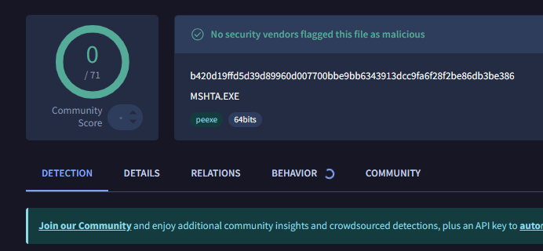
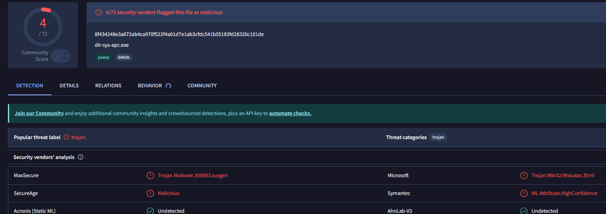
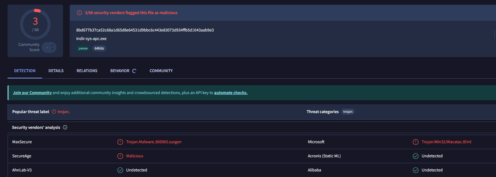
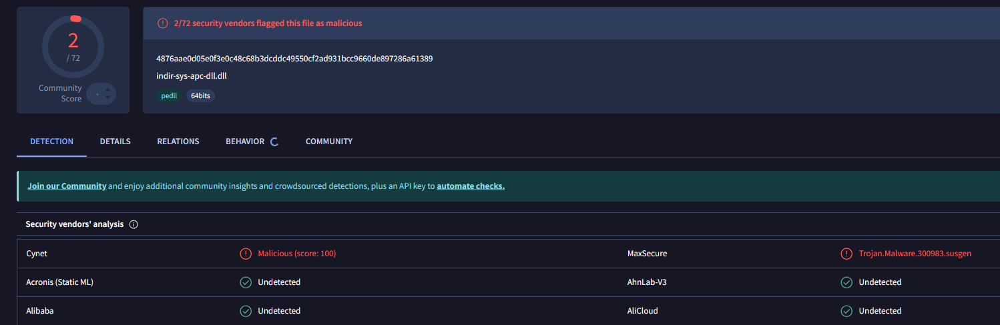
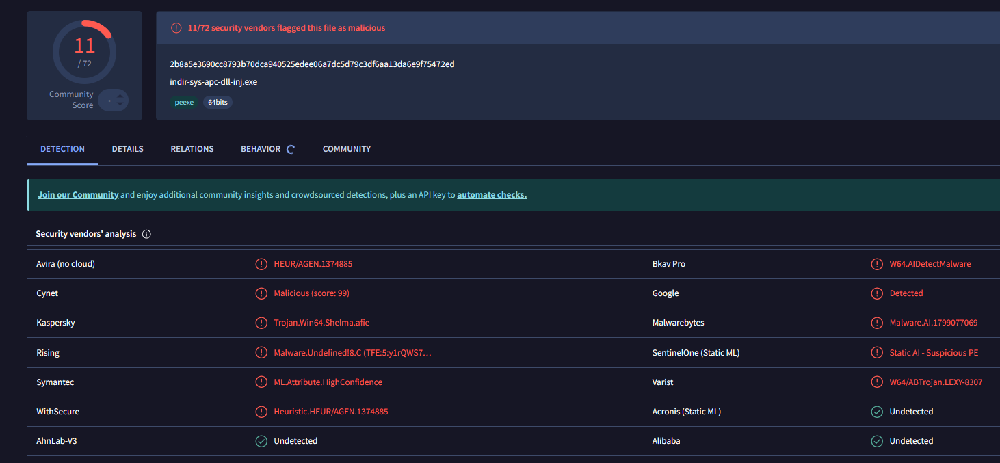
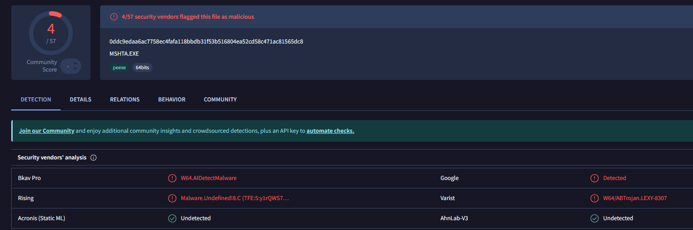
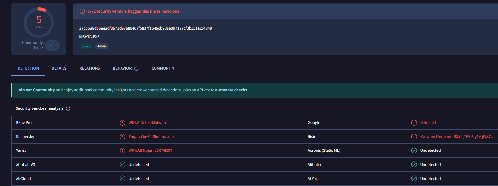

# Syscall Apc Injection Trojans (Direct & Indirect)



Collection of remote shellcode Loaders using APCs, direct/indirect syscalls, ntdll and low level utilities, undetected by Windows Defender and BitDefender. This code is for educational purposes only, do not use it for any malicious or unauthorized activity.

This repo is an improved version of [this](https://github.com/Hue-Jhan/Ntdll-Apc-Injection-Trojans), and includes both the direct syscall and indirect syscalls version of a classic shellcode injection via Asynchrnous procedure calls, its dll version, and a DLL injector queuing LoadLibraryA.

# 🖥️ Code

Consists of 6 projects that have the same basic structure and share most of the code, they are: Nt APC injection, DLL version, and a DLL Injector (LoadLibrary using APC), all of these have the direct/indirect syscalls version. The shellcode is for a windows msg box, in all of the samples there are 2 versions of choosing the thread upon which to queue the shellcode/dll:
- We either find the first thread and queue to it;
- Or we enumerate every thread of the process and queue to all of them.

Next to each code as you can see i put the virus total detections for its raw executable.

### 0) Direct & Indirect System Calls Explained

On Windows, native API functions inside `ntdll.dll` ultimately execute a syscall instruction to transition from user mode to kernel mode. Because standard WinAPI wrappers and ntdll exports are heavily monitored by user-mode EDR hooks, this architecture bypasses them by dynamically resolving System Service Numbers (SSNs) at runtime:

- **Unmodified Execution Flow:** This is not full ntdll unhooking; rather than rewriting functions, it bypasses user-mode prologue hooks (`jmp`) by constructing clean, custom execution stubs containing the target SSN (`mov eax, SSN`).

```asm
mov r10, rcx
mov eax, 0x00001BE   ; SSN
syscall
```

- **Direct vs. Indirect Approach:** Direct syscalls execute the kernel transition directly from application space. Indirect syscalls locate a valid, unhooked native `syscall` instruction inside `ntdll.dll` and jump to it after setting the SSN, keeping instruction pointers aligned closer to expected operating system boundaries.

 
To resolve native procedures without calling standard Windows APIs, I used `GetProcAddressManualEx()`, a custom function made by ChatGPT- ehm, me, that parses the PE headers and walks the export directory directly from memory. The breakdown of this process includes:

1. **DOS Header:** Read the DOS header and use `e_lfanew` to locate the NT headers.
2. **NT Headers:** At `base + e_lfanew`, find the NT headers (signature + `IMAGE_FILE_HEADER` + `IMAGE_OPTIONAL_HEADER`). The optional header contains the DataDirectory array.
3. **Export Directory RVA:** `OptionalHeader.DataDirectory[IMAGE_DIRECTORY_ENTRY_EXPORT]` provides the RVA and size of the Export Directory (`base + rva` points to the `IMAGE_EXPORT_DIRECTORY` in memory).
4. **Directory Arrays:** The Export Directory contains three core lists:
   * `AddressOfNames`: Array of RVAs to ASCII function names (e.g., `nameRvas[i] = "LoadLibraryA"`).
   * `AddressOfNameOrdinals`: Array where each index corresponds to a function name and points to its ordinal (`ordinals[i] = index into AddressOfFunctions`).
   * `AddressOfFunctions`: Array of RVAs pointing to the real exported functions (`funcRvas[ordinal] = RVA of the actual function`).

So to resolve a name we find the name in the AddressOfNames array, get its ```ordinals[i]``` value (index), read ```funcRvas[ordinals[i]]```, and convert the function RVA to an absolute address by adding the module base: ```funct_add = base + funcRvas[ordinals[i]]```. 

> [!NOTE]
> If funcRva points back inside the export directory region then the entry is a forwarded export, in this case and in other special cases like failing to validates the DOS header magic (MZ) and the PE signature, or if the RVA is too big, the function simply returns null.


### 1) Syscall APC Process Injection 


1) The encrypted payload is decrypted in memory;
2) System processes are enumerated via `NtQuerySystemInformation()` to identify the target PID, then we obtain a handle using `NtOpenProcess()`; 
3) Memory allocation, writing, and protection changes (RWX) are done inside the remote process using custom syscall-backed native routines;
4) Target threads are enumerated, handles are retrieved via `NtOpenThread()`, and the payload is queued using native APC functions (`NtQueueApcThread`) to execute when threads enter an alertable state.

### 2) DLL Version 



The DLL variant operates internally within the process it is loaded into, using `GetCurrentProcessId()` to target its host environment (no need to use syscalls as this function is commonly used in programs). 

Also it spawns a new execution thread outside the loader lock to prevent deadlocks. Try to disable precompiled headers in Visual Studio build config to avoid compile errors.

### 3) DLL Injection via APC


Extracts an embedded DLL resource, writes it to disk, and leverages `LoadLibraryA` queueing via APCs:
1) Extracts resource data and computes path lengths and sizes;
2) Resolves the target process and secures a handle; 
3) Allocates space within the remote process, writes the absolute DLL path string, and marks the region RWX;
4) Locates the base address of `kernel32.dll` to acquire the `LoadLibraryA` pointer;
5) Queues `LoadLibraryA` with the path string base address to target thread queues, either to its first thread of the process or to all of them.

This dll injection method is not stealthy at all (because it uses loadlibrary) but it's the fastest, also DLLs are by default stealthier than executables even if they are written to disk.

# 🛡️ AV Detection


Typically bypasses static signatures form basically every AV, especially when metadata is aligned or wrapped using native utility signatures (e.g., `Mshta.exe` or custom MSI packages).


Hoewver it will still get blocked (not flagged though) because when the CPU hits that syscall instruction in ntdll.dll, the Kernel and Bitdefender's driver look at the Call Stack and can clearly see that the jmp doesn't push a return address correctly for an ntdll transition. Normally the return address on the stack should point to the instruction immediately after the syscall in ntdll.dll, but in this case the caller of the syscall was actually some random unsigned code in the .exe's memory space, and Bitdefender flags this as Stack Pivot or Abnormal System Call.

Because the code (non-system process) manually parses the PE Export Directory and scans ntdll.dll for 0xB8 (mov eax) and 0x0F 0x05 (syscall) opcodes, ATD triggers a Memory Scanning alert, which raises the "suspicious" level. Thats why (in my opinion) the flow is interrupted, blocked, but not flagged as malicious or notified to the user. 


Modern kernel protections, event tracing (ETW), and technologies like Intel CET (Control-flow Enforcement Technology) monitor indirect branch tracking and shadow stacks, which means kernel-level logging remains the best solution against manual trampolining and non-standard execution flows.
